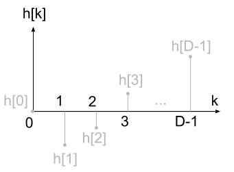
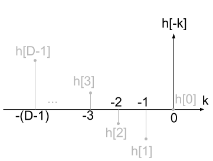
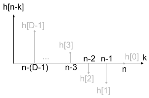
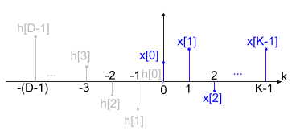
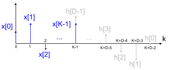

# Determinação do comprimento P

Pode-se determinar o comprimento $P$ da sequência $y[n]$ gerada na saída do sistema em função de $K$ e $D$, comprimentos da entrada $x[n]$ e $y[n]$ respectivamente, com o método de cálculo analítico da convolução. Tal procedimento faz referência ao exemplo dado em aula pelo professor e ao exemplo 11 do capítulo 2 do  livro texto. A operação de convolução é dada por

```math
y[n]=x[n]*h[n]=\sum_{k=-\infty}^{\infty}{x[k]h[n-k]}
```

Iniciamos o processo operando sobre a resposta ao impulso. O objetivo é obter $h[n-k]$ neste primeiro momento. A função de resposta ao impulso pode ser esboçada (como sugere o enunciado) por:



Espelhamos o sinal



e efetuamos um deslocamento de $n$ amostras e forma-se o sinal $h[n-k]$



Neste segundo momento iremos avaliar os extremos da convolução discreta. Para isso, analisaremos, primeiramente n=0, posição que a resposta ao impulso “toca” o sinal de entrada:



Dessa imagem podemos notar que $n<0$ implica $y[n]=0$ uma vez que um nessas regiões os produtos das amostras da resposta ao impulso com a entrada seriam nulas. Isso se dá porque $x[n]=0$ para $n<0$, por definição do sinal.
O outro extremo pode ser analisado por partes. Imagine primeiramente que o deslocamento será de $n=K-1$. Nessa condição, a amostra $h[0]$ coincidirá com a amostra $x[K-1]$. Com essa intuição, podemos imaginar então a segunda parte do raciocínio, quando a amostra $h[D-1]$ coincida com $x[K-1]$. Essa será o outro extremo do cálculo da convolução. Para que essa situação ocorra, teremos que fazer o deslocamento ser $n=K+D-2$. Segue o gráfico dessa última condição:



Note que, um incremento unitário no deslocamento, todos os produtos se anulam, como no caso de $n<0$. Dado isso, temos também $y[n]=0$ para $n>K+D-2$, e, podemos escrever, de uma forma mais ampla:

```math
y[n] =
  \begin{cases}
    x[n]*h[n], & 0 \leq n \leq K+D-2\\
    0        , & caso\ contrário    
  \end{cases}
```

Fica evidente dessa análise que o comprimento temporal da saída $y[n]$ será dado por

```math
P=K+D-1
```

a soma de uma unidade em relação ao intervalo definido na função por partes de deve por esse conjunto iniciar em zero.
